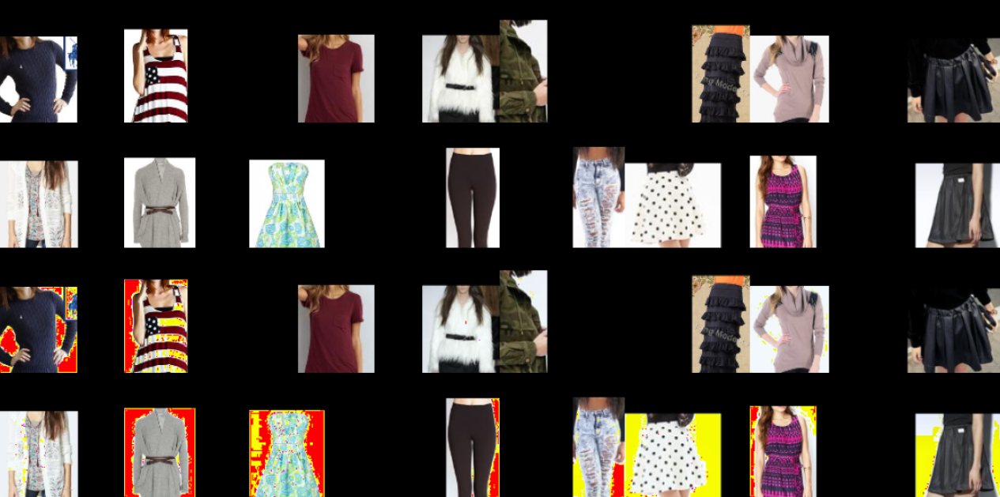

# Fashion_Search

## About

A computer vision project which inputs a cloth and output similar cloths. 

Using UNET to reconstruct image, then with extracted latent vectors, similar cloth can be obtained.

### Reconstruct

### Near Search

